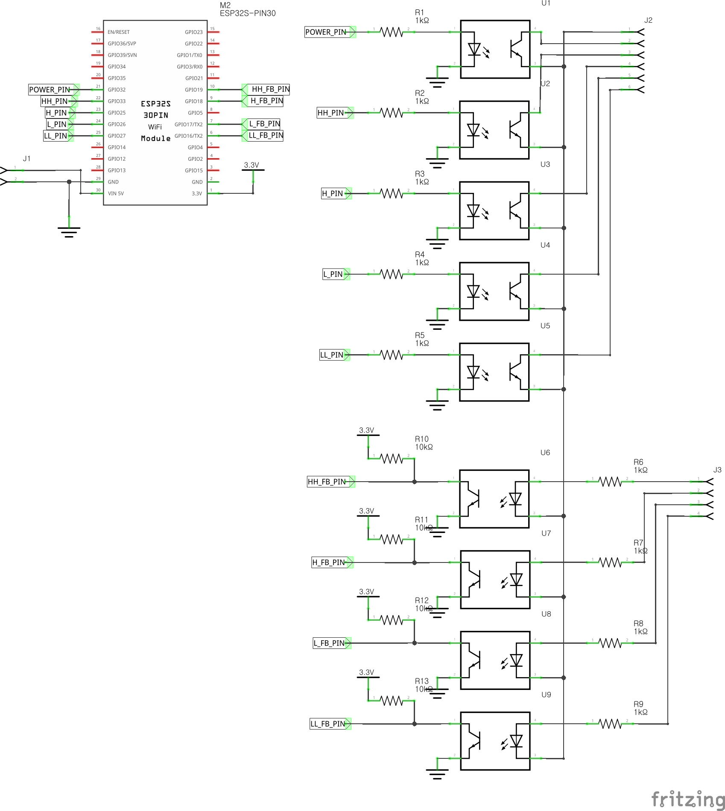
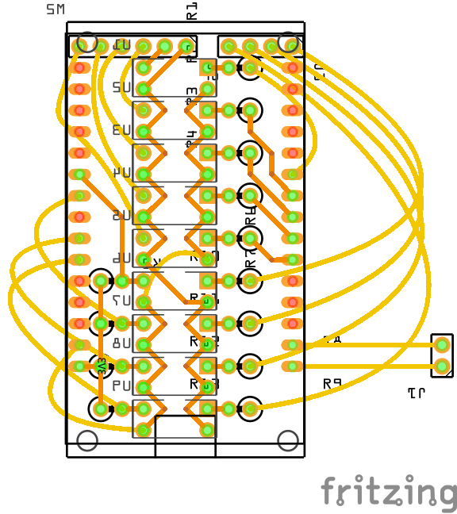

# Vornado 660
## 개요
Vornado 660 서큘레이터를 위한 ESPHome External Components 입니다.

| 기능 | 지원 | 비고 |
| - | :-: | - |
| 원격 조작 | ✔️ | |
| 기존 버튼을 통한 조작 | ✔️ | |
| ESP Reset 시 상태 유지 | ✔️ | |
| 정전 보상 | ❌ | Vornado 자체에서 미지원 |

PC817 포토 커플러 9개를 이용하여 제어 및 피드백을 받을 수 있도록 제작되었습니다.

- 전원 버튼
- 풍속 1단 버튼
- 풍속 2단 버튼
- 풍속 3단 버튼
- 풍속 4단 버튼
- 풍속 1단 피드백
- 풍속 2단 피드백
- 풍속 3단 피드백
- 풍속 4단 피드백


## 설치
### 하드웨어
준비물

| 품목 | 개수 | 비고 |
| - | -: | - |
| ESP32 30핀 개발보드 | 1 | |
| PC817 및 소켓 | 9 | |
| 1kΩ 저항 | 9 | |
| 10kΩ 저항 | 4 | |
| 2.54mm 핀 헤더 및 소켓 | - | |
| 와이어링용 배선 | - | |

ESP32 사용을 권장드립니다. ESP8266 은 제약 없이 사용할 수 있는 핀이 5개 뿐이므로 권장되지 않습니다.

30핀이 아닌 다른 형태의 개발보드도 가능합니다. 그러나 회로를 직접 수정하셔야 합니다.






### 설정
설정 예제:

```yaml
external_components:
  - source: github://deltafish32/esphome-components/vornado_660
    refresh: always

fan:
  - platform: vornado_660
    name: Circulation Fan
    id: circulation_fan
    power_pin: 32
    ll_pin: 27
    l_pin: 26
    h_pin: 25
    hh_pin: 33
    ll_fb_pin: 16
    l_fb_pin: 17
    h_fb_pin: 18
    hh_fb_pin: 19
```


## 기타
Vornado 660 의 대기전력이 높은 편입니다 (약 7.2W). 릴레이를 이용하여 대기전력 차단 기능을 넣었다가, 버튼을 통해 전원을 켤 수 없는 문제로 삭제하였습니다. 
