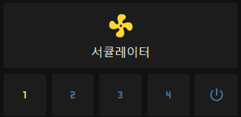

# Vornado 660

[한국어](README.md)
[English](README_en_US.md)

## 개요
Vornado 660 서큘레이터를 위한 ESPHome External Components 입니다.

| 기능 | 지원 | 비고 |
| - | :-: | - |
| 원격 조작 | ✔️ | |
| 기존 버튼을 통한 조작 | ✔️ | |
| ESP Reset 시 상태 유지 | ✔️ | |
| 정전 보상 | ❌ | Vornado 자체에서 미지원 |

PC817 포토 커플러 9개를 이용하여 제어 및 피드백을 받을 수 있도록 제작되었습니다.

- 전원 버튼
- 풍속 1단 버튼
- 풍속 2단 버튼
- 풍속 3단 버튼
- 풍속 4단 버튼
- 풍속 1단 피드백
- 풍속 2단 피드백
- 풍속 3단 피드백
- 풍속 4단 피드백


## 설치
### 하드웨어
준비물

| 품목 | 개수 | 비고 |
| - | -: | - |
| ESP32 30핀 개발보드 | 1 | |
| PC817 및 소켓 | 9 | |
| 1kΩ 저항 | 9 | |
| 10kΩ 저항 | 4 | |
| 2.54mm 핀 헤더 및 소켓 | - | |
| 와이어링용 배선 | - | |

ESP32 사용을 권장드립니다. ESP8266 은 제약 없이 사용할 수 있는 핀이 5개 뿐이므로 권장되지 않습니다.

30핀이 아닌 다른 형태의 개발보드도 가능합니다. 그러나 회로를 직접 수정하셔야 합니다.

자세한 내용은 [여기](pcb/pcb.md)를 참고해주십시오.


### 설정
기본 예제:

```yaml
external_components:
  - source: github://deltafish32/esphome-components
    refresh: always

fan:
  - platform: vornado_660
    name: Circulation Fan
    id: circulation_fan
    power_pin: 32
    ll_pin: 27
    l_pin: 26
    h_pin: 25
    hh_pin: 33
    ll_fb_pin: 16
    l_fb_pin: 17
    h_fb_pin: 18
    hh_fb_pin: 19
```

버튼과 상태 표시를 위한 템플릿 스위치 추가:

```yaml
switch:
  - platform: template
    name: circulation_fan_1
    lambda: |-
      return id(circulation_fan).state && id(circulation_fan).speed == 1;
    turn_on_action:
      - lambda: |-
          auto call = id(circulation_fan).make_call();
          call.set_state(true);
          call.set_speed(1);
          call.perform();
    turn_off_action:
      - lambda: |-
          auto call = id(circulation_fan).make_call();
          call.set_state(false);
          call.perform();
  - platform: template
    name: circulation_fan_2
    lambda: |-
      return id(circulation_fan).state && id(circulation_fan).speed == 2;
    turn_on_action:
      - lambda: |-
          auto call = id(circulation_fan).make_call();
          call.set_state(true);
          call.set_speed(2);
          call.perform();
    turn_off_action:
      - lambda: |-
          auto call = id(circulation_fan).make_call();
          call.set_state(false);
          call.perform();
  - platform: template
    name: circulation_fan_3
    lambda: |-
      return id(circulation_fan).state && id(circulation_fan).speed == 3;
    turn_on_action:
      - lambda: |-
          auto call = id(circulation_fan).make_call();
          call.set_state(true);
          call.set_speed(3);
          call.perform();
    turn_off_action:
      - lambda: |-
          auto call = id(circulation_fan).make_call();
          call.set_state(false);
          call.perform();
  - platform: template
    name: circulation_fan_4
    lambda: |-
      return id(circulation_fan).state && id(circulation_fan).speed == 4;
    turn_on_action:
      - lambda: |-
          auto call = id(circulation_fan).make_call();
          call.set_state(true);
          call.set_speed(4);
          call.perform();
    turn_off_action:
      - lambda: |-
          auto call = id(circulation_fan).make_call();
          call.set_state(false);
          call.perform();
```

Lovelace 설정:

```yaml
type: vertical-stack
cards:
  - show_name: true
    show_icon: true
    type: button
    entity: fan.circulation_fan
    show_state: false
    icon_height: 40px
    icon: ''
    tap_action:
      action: more-info
  - square: true
    columns: 5
    type: grid
    cards:
      - show_name: false
        show_icon: true
        type: button
        tap_action:
          action: call-service
          service: switch.turn_on
          service_data: {}
          target:
            entity_id: switch.circulation_fan_1
        entity: switch.circulation_fan_1
        icon: mdi:numeric-1
      - show_name: false
        show_icon: true
        type: button
        tap_action:
          action: call-service
          service: switch.turn_on
          service_data: {}
          target:
            entity_id: switch.circulation_fan_2
        entity: switch.circulation_fan_2
        icon: mdi:numeric-2
      - show_name: false
        show_icon: true
        type: button
        tap_action:
          action: call-service
          service: switch.turn_on
          service_data: {}
          target:
            entity_id: switch.circulation_fan_3
        entity: switch.circulation_fan_3
        icon: mdi:numeric-3
      - show_name: false
        show_icon: true
        type: button
        tap_action:
          action: call-service
          service: switch.turn_on
          service_data: {}
          target:
            entity_id: switch.circulation_fan_4
        entity: switch.circulation_fan_4
        icon: mdi:numeric-4
      - show_name: false
        show_icon: true
        type: button
        tap_action:
          action: call-service
          service: fan.toggle
          service_data: {}
          target:
            entity_id: fan.circulation_fan
        icon: mdi:power-standby
```




## 기타
Vornado 660 의 대기전력이 높은 편입니다 (약 7.2W). 릴레이를 이용하여 대기전력 차단 기능을 넣었다가, 버튼을 통해 전원을 켤 수 없는 문제로 삭제하였습니다. 
