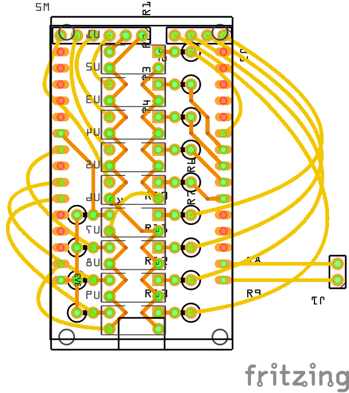

# Vornado 660
## Overview
ESPHome External Components for Vornado 660 series.

| Feature | Support | Memo |
| - | :-: | - |
| Remote control | ✔️ | |
| Original button control | ✔️ | |
| Keep states when reset ESP | ✔️ | |
| Blackout compensation | ❌ | not supported by Vornado |

It is designed to receive control and feedback using 9 PC817 photo couplers.

- Power button
- Wind speed 1 button
- Wind speed 2 button
- Wind speed 3 button
- Wind speed 4 button
- Wind speed 1 feedback
- Wind speed 2 feedback
- Wind speed 3 feedback
- Wind speed 4 feedback


## Install
### Hardware
BOM

| Item | Quantity | Note |
| - | -: | - |
| ESP32 30-pin development board | 1 | |
| PC817 and sockets | 9 | |
| 1kΩ resistors | 9 | |
| 10kΩ resistors | 4 | |
| 2.54mm pin headers and sockets | - | |
| Some wires | - | |

Recommend using ESP32. ESP8266 is not recommended as it only 5 unrestricted pins.

Any ESP32 board can be used. However, you will have to modify the circuit yourself.





### Configuration
Configuration example:

```yaml
external_components:
  - source: github://deltafish32/esphome-components/vornado_660
    refresh: always

fan:
  - platform: vornado_660
    name: Circulation Fan
    id: circulation_fan
    power_pin: 32
    ll_pin: 27
    l_pin: 26
    h_pin: 25
    hh_pin: 33
    ll_fb_pin: 16
    l_fb_pin: 17
    h_fb_pin: 18
    hh_fb_pin: 19
```


## Trivia
The standby power of the Vornado 660 is rather high (about 7.2W). I put the relay in and then deleted it, but there was a problem that the power could not be turned on with the button.
