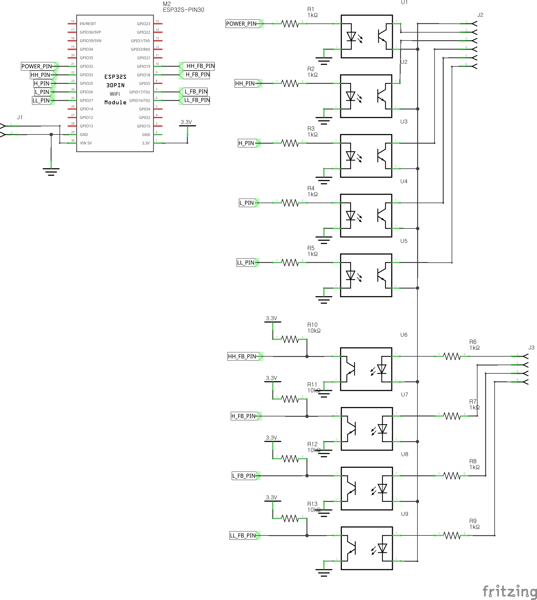

# PCB
## 개요
Vornado 660 제어용 PCB 자료입니다.

제작에 앞서, 개조에 대한 모든 책임은 본인에게 있습니다. **반드시 안전에 유의하십시오.**

PCB for Vornado 660 control.

Prior to production, you are responsible for all modifications. **BE SURE TO BE SAFE.**

## 도면
Fritzing 파일 포함되어 있습니다.

Fritzing files included.

## 패턴

## 참고 이미지

**반드시 DVM(테스터기)으로 확인 후 작업하시기 바랍니다!!** 문제 발생시 책임지지 않습니다.

**BE SURE to check with DVM before soldering!!** Not responsible for any problems.

